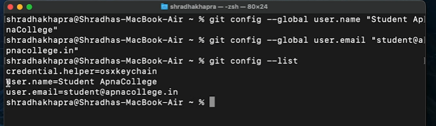

# Git Apna College Notes.

### <qs>Remember custom html tags for notetaking for Markdown Format:</qs>

- <qs>Question? and new topic:</qs>
- <as>Answer\*:</as>
- <sy>Syntax^</sy>
- <im>Important!</im>
- <od> Old method$</od>
- <st>story&</st>
- <ar>any other%</ar>
- <cg>Chatgpt+:</cg>
- <at>Newsection@</at>

---

### <qs>Git

1. Version control
2. Track history if problem arises go back to previous working code.
3. Collaborate.

---

### <qs>Github

1. Repositories in github means Folders

---

### <qs> Git commands

1. add- engagement
2. commit- shadi
3. .

---

<sy>git config --global user.name “[firstname lastname]”

<sy>git config --global user.email “[valid-email]”

<sy>git config --list</sy>

---

### <qs> In git terminal $ or ~ means root directory the first folder through which children grand children folders are made.

---

### <qs>Use same email and username for configuring in global which you have used to make account in github.

#### <at> Clone and Status

1. Remote means Github
2. Local means Laptop

## 

### <qs> Commands and working on terminal.

1. <im>cd</im>- Change directory.
2. <im>cd..</im> to go out of the directory /folder.
3. <im>mkdir [Name of the folder]</im>. To make new directory or folder
4. Cd and than <im>press tab for autocomplete.
5. <im>ls</im> i.e list of files
6. <im>ls -a</im> i.e. To access all files including hidden files
7. <im>Clear</im>.
8. <im>git add</im>. the files get the status of staged.and is ready to be committed.
9. <im>git status</im>.
10. <im>git log</im>. To see all changes.

<im>In Vs code 'm' is modified, 'u' is untracked.Which can be seen on the left files section of vs code.

## 

### <qs> Commit Commands.

7. <im>git commit -m "message"</im> Give meaningful message like button add, bug fixed. etc.

<as> Your branch is ahead of 'origin/main' by 1 commit means in local (<ar>in our laptop we have extra change than in remote i.e in github webiste. </ar>)

---

---

### <qs> Push Commands.

<im>git push origin main

1. In the above remote default repo name is <im>origin
2. <im> Main </im> is the branch of that origin.There may be other branches also

---

### <qs> Init Commands.

1. <im>git init.</im> To create git folder/file in the local system to track your changes.
2. <im>git remote add origin. <- Link-></im>.<as> Where link we get from github website after we make new repository. Copy that and paste in place of link.
3. <im>git remote -v.</im> To check the 2nd step remote add origin address and whether is working.
4. <im>git branch</im> <as>To check branch name if <im>master</im> we change that name as everyone is now using main. As many feel master is derogatory.
5. <im>git branch -m main </im> <as> Remeber that <im>main</im> is the name of the brach we are giving it can be any name even orange.
6. <im>git push origin main </im> using this we can now push changes that made to our new project.
7. <im>git push -u origin main </im> <sy>where -u flag u is known as upstream </sy>. So when we are only going to push to main than instead of writing long code we can ignore <as> -u origin main</as> and only add <as>git push. from than onwards.

## 

## 

### <qs> Git Branches.

1. <im>git branch.</im> To check branch
2. <im>git checkout -b feature1.</im> Create and Switch to new branch called feature1
3. <im>git checkout main (or any name).</im> To switch to that branches.
4. <im>git branch -d <-branch name->.</im> to deletee that branch.
5. <as>When you want to delete the branch you should be not in that branch. You can delete only if you are in the other branch.
6. <im>git push origin feature1</im> We can push to this branch after creating feature.

---

### <qs> Merging Branches.

#### <as> First way to merge is in Github by PR i.e PUll Request.

The Github website than checks for any changes. If there are conficts between branches permission is denied and also while working for companies senior developer or product manager approve pull request.

<im>Once pull request is done on github than we want that locally.<as> We use command <sy> git pull origin command.</sy> To get that changes on our local computer.

## 

### <qs> Resolving Merge Conflicts.

<as> On local on git terminal we can merge using the command <sy>git merge.

### <qs> Undoing Changes.

<as>Using the command <sy>git reset HEAD-1 </sy> we delete the last commit.

<as>Using the command <sy>git log</sy>. We can get previous hash id's. Than we can use that hash id to go long back in commits by using <sy>git reset <-commit hash->

## <as><sy>git hard reset <-commit hash-> to even reset in vs code

### <qs> Fork.

Is to download other people projects codes like express etc to your own github website and than see the code and learn.
